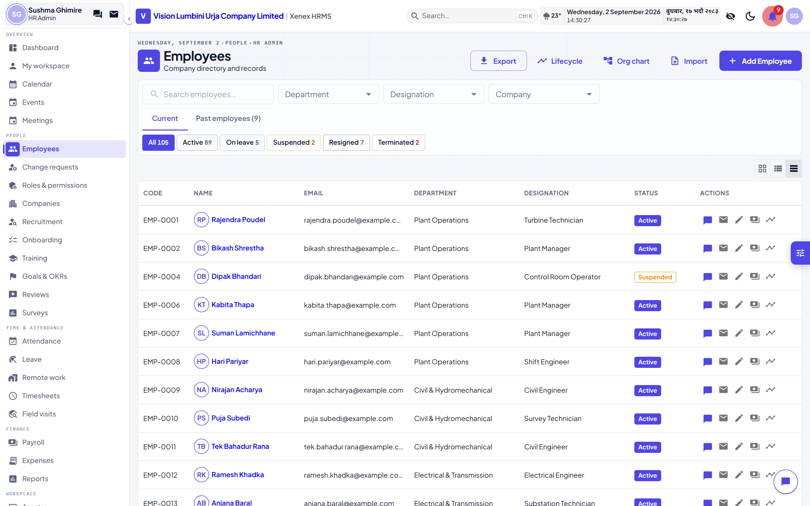
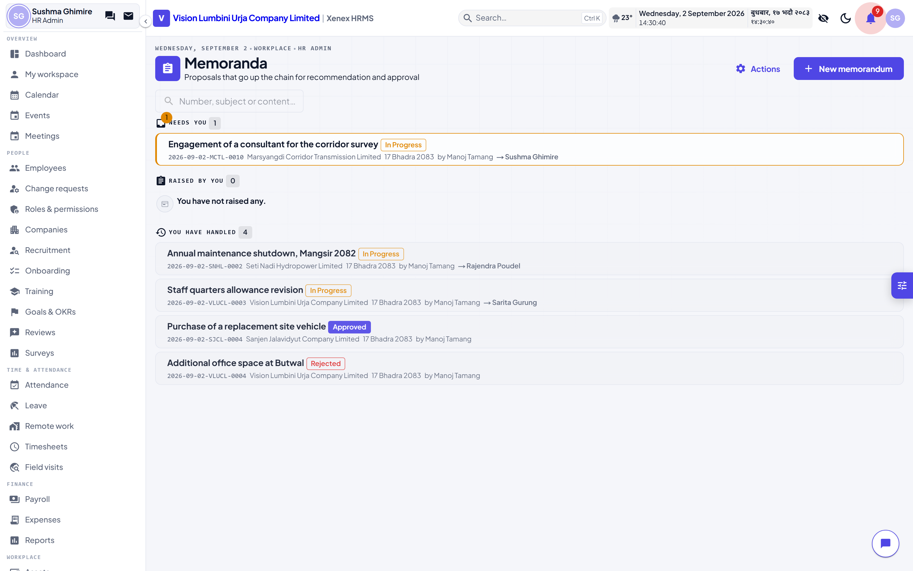
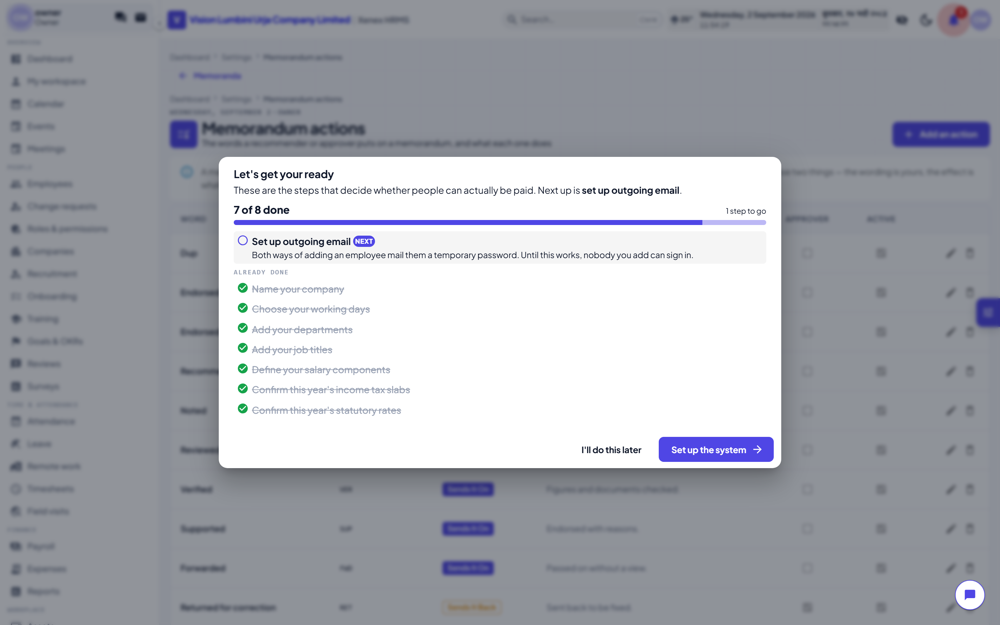
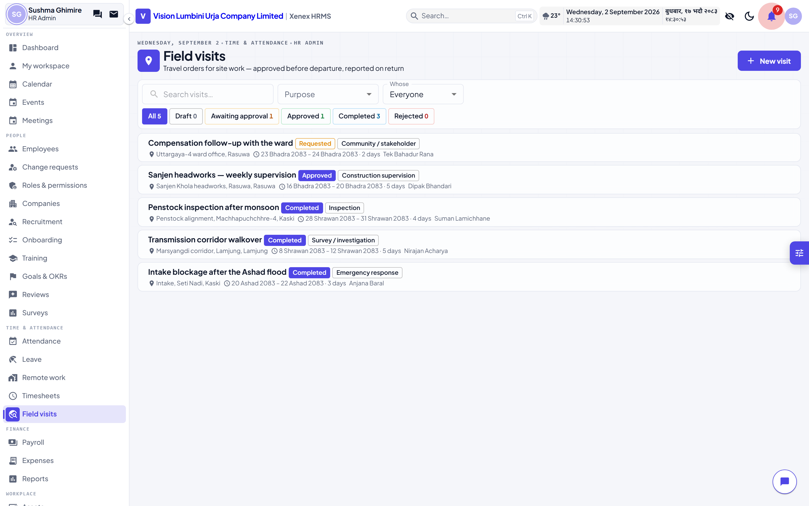
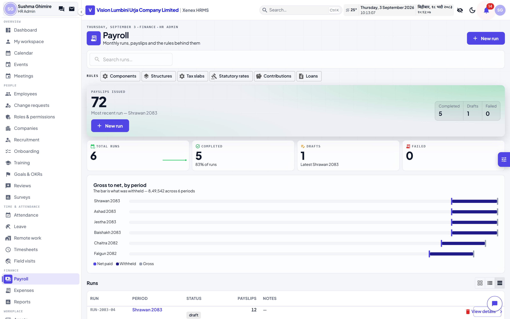

# Xenex HRMS — Testing Guide

**Vision Lumbini Urja Company Limited**
Butwal-8, Rupandehi · Lumbini Province

This is the guide for trying the system on a machine that has it running. It
covers how to start it, who to sign in as, and what to check for each module.

Everything below has been run against the seeded database. Where a step has a
known limitation, it says so rather than leaving you to find it.

---

## 1. Starting the system

Everything runs in Docker under the project name `hrms-hydro`. It is deliberately
separate from any other HRMS stack on the same machine — its own containers,
images, volumes and ports — so both can run at once without colliding.

```bash
cd hrms-hydro/deployment
docker compose up -d
```

Seven containers come up. Give it two to three minutes on a first run: the
frontend container builds the app before it serves it.

| What | Where | Notes |
|---|---|---|
| **The application** | http://localhost:3001 | Start here |
| Backend API | http://localhost:8001 | JSON only |
| Django admin | http://localhost:8001/admin/ | Owner account works here too |
| Mailhog (outgoing mail) | http://localhost:8026 | Every email the system sends lands here |
| PostgreSQL | localhost:5442 | |
| Redis | localhost:16381 | |

Check they are all healthy:

```bash
docker ps --filter name=hrms-hydro --format "{{.Names}}\t{{.Status}}"
```

**No mail leaves the machine.** The system is pointed at Mailhog, so suspension
notices, memorandum alerts and password resets all land in the web inbox at
:8026 and nowhere else. If you want to see what an employee would have received,
that is where to look.

### Loading the sample data

The database ships seeded. To reset it to a known state:

```bash
docker exec hrms-hydro-backend python manage.py seed_hydro --owner-password 'TestPass123!'
```

`--owner-password` is opt-in and never runs by default — a seed that silently
reset the owner's password would be a problem on a real installation.

---

## 2. Signing in

**The password for every account is `TestPass123!`**

These are fictional people in a seeded database. None of the email addresses are
real — `example.com` is reserved by the IETF precisely so it can never belong to
anybody.

| Role | Username | Employee | What they can do |
|---|---|---|---|
| **Owner** | `owner` | — | Everything. The only role that can appoint an HR admin. Also has Django admin. |
| **HR admin** | `sushma.ghimire` | EMP-0022 | Everything except appointing admins. Creates, edits, deletes. |
| **HR officer** | `tenzing.neupane` | EMP-0079 | Edits and views. **Cannot create or delete anything.** |
| HR officer | `rachana.baral` | EMP-0094 | A second officer, for testing two people on one record |
| **Employee** | `rajendra.poudel` | EMP-0001 | Their own record; also the approver on every seeded memorandum |
| Employee | `hari.pariyar` | EMP-0008 | Raised every seeded memorandum |
| Employee | `kabita.thapa` | EMP-0006 | First recommender on the seeded chains |
| Employee | `bikash.shrestha` | EMP-0002 | Last recommender before the approver |
| **Suspended** | `sarita.gurung` | — | **Cannot sign in** — use this to test the lock. Deliberately kept out of every approval chain |

There are 96 more employees, all `firstname.lastname`.

> **The owner has no employee record.** That is deliberate — the owner is the
> account the system was installed under, not a member of staff. It means the
> owner cannot *raise* a memorandum or request leave, because those belong to a
> person. Sign in as an HR admin or an employee for anything that needs one.

### What to check on the sign-in screen


1. The left half names **Vision Lumbini Urja Company Limited** and lists the four
   entities in the group with their codes — VLUCL, SNHL, SJCL, MCTL.
2. The password box has an **eye icon** on the right. Click it: the password
   becomes readable. Click again: hidden. It resets whenever you leave the page.
3. There are **no "Continue with Google/Microsoft" buttons.** This is a
   single-company installation; accounts are created from inside the product.
4. Sign in with a wrong password. The message should say the credentials are
   wrong. Sign in as `sarita.gurung` and it should say the account is
   **suspended**, not just that the login failed.

---

## 3. The roles, and what separates them

This is the rule the whole system is built around, and it is worth testing first
because everything else inherits it.

**An HR admin creates. An HR officer operates.**

Sign in as `tenzing.neupane` (officer) and try each of these on any employee:

| Action | Expected |
|---|---|
| Open an employee, change their blood group, save | **Works** |
| Click "Add Employee" | **Refused** — "This account may not create records of this kind." |
| Try to delete anything | **Refused** — "…may not delete records of this kind." |
| Open Payroll | **Not in the menu** — an officer holds no payroll permission by default |
| Open Settings → salary components | **Refused** — shaping the system is the admin's |

Then sign in as `sushma.ghimire` (admin) and repeat: all of it works.

The refusal message names the verb that was actually refused. If you ever see
"may not create or delete" while editing, that is a bug — report it.

---

## 4. Employees



### The list

- **Search** sits under the page title, on the left of the filter card — not up
  in the header next to the buttons. Every list in the system uses this same
  arrangement.
- **Status chips** below it are both the count and the filter. Click "Suspended"
  and the list narrows; the number on the chip is the whole directory, not the
  page you are looking at.
- **Current / Past employees** tabs separate the roster from leavers.
- Pagination sits at the bottom in its own bar and **disappears entirely** when
  everything fits on one page.

### Opening someone

Click any employee card or row. There is **one** profile page — everything routes
to `/employees/<id>` no matter where you clicked from.

Tabs across the top: Overview, Record, Payroll, Attendance, Training, Projects,
Personal, Conduct, Lifecycle, Activity.

### What an HR admin can edit that a colleague cannot see

Open an employee as `sushma.ghimire`, click **Edit**, and confirm these fields
are all present and saveable:

- **Reports to** — this field *is* the organisation chart. Everything on
  `/employees/org-chart` is drawn from it.
- **Probation ends**
- Corporate post and corporate role (two different things — the post is what you
  are appointed to, the role is what you are responsible for)
- Primary company, and secondary companies as a multi-select widget
- Blood group, permanent address, temporary address
- Office cell and office email · personal cell and personal email
- Bank details, legal names, citizenship, PAN, SSF, PF, CIT

Now sign in as `rajendra.poudel` and open the same person. You should see their
office phone, office email and blood group — and **not** their personal phone,
personal email, permanent address, temporary address, bank account or
citizenship number.

### Suspension

On an employee's **Conduct** tab, suspend them with a start date and an optional
end date.

1. The roster status becomes **Suspended** and a banner appears on their profile.
2. Their account is locked immediately — try signing in as them.
3. The refusal names the suspension rather than saying the password is wrong.
4. A notice appears in **Mailhog** at :8026, sent to their personal address if
   they have one.
5. Lift the suspension with an outcome — reinstated, withdrawn or terminated. The
   first two unlock the account the same day.

> **Suspended is not a status you can pick from the dropdown.** It comes from a
> suspension record, so the interval, the reason and the account lock always move
> together. A dropdown would let someone be "suspended" with no record of since
> when and still able to sign in.

---

## 5. Memorandum



This is the largest workflow in the system. The seeded database has eight
memoranda covering every state.

### The desk

`Memoranda` in the sidebar, under **Workplace**. Three sections:

- **Needs you** — waiting on you right now, highlighted
- **Raised by you**
- **You have handled**

Searching switches to a flat result list across everything you can see.

### It opens as a letter

There are no tabs. A memorandum is one page, laid out the way one is actually
written:

```
              Sanjen Jalavidyut Company Limited
                       Rasuwa, Bagmati
                        MEMORANDUM
────────────────────────────────────────────────────────
Ref:   2026-09-02-SJCL-0005            Date:  17 Bhadra 2083
To:    Rajendra Poudel, Chief Executive Officer
From:  Hari Pariyar, Shift Engineer
────────────────────────────────────────────────────────
Subject:  Revision of the Sanjen access road alignment

    …the proposal…
```

**Where a field can still be changed, the control is in the place its value
would be printed.** The company picker *is* the letterhead. The subject box *is*
the subject line. The editor *is* the body. There is nothing to learn beyond
where to click.

The **status** and **who is holding it** sit clipped to the top-right corner,
outside the sheet — a real memorandum does not carry a chip reading "in
progress".

Below the page, in order: **Attachments**, **Who signs it** (recommenders, then
the approver — who becomes the To), and **What has happened to it**.

| Line | Changeable |
|---|---|
| Ref | Never typed. Issued by the system at submission |
| Date | While it is a draft, and must be today when you submit |
| To | Until it reaches them — chosen under *Who signs it* |
| From | Never. Whoever raised it |
| Subject | While it is a draft |
| Body | The one field that survives submission, by the initiator |

### Raising one

1. Click **New memorandum**. A blank letter opens.
2. Click the **letterhead** and pick a company — its code goes into the number.
3. The **date** is today and must still be today when you submit. Backdating is
   refused: a memorandum is dated the day it is raised.
4. Click the **subject line** and write one.
5. Click into the **page** and write the proposal — bold, italic, underline,
   font size, lists, alignment.
6. Scroll below the page to **Who signs it**. Add **recommenders** in the order
   they should see it, then **one approver**.
7. Click **Save draft**.

> The dialog reopens on the saved draft rather than closing. Attachments hang off
> a memorandum, so there has to be one before you can attach anything.

8. Now attach files. Multiple, each with an optional caption. This is the
   initiator's, and only on their turn — a draft, or one sent back to them.
9. Click **Submit**.

The number appears: `2026-09-02-VLUCL-0001` — date, company code, serial. It is
minted at submission, never at creation, so an abandoned draft does not consume a
number out of the register.

### Moving it along

Sign in as the first recommender. The memorandum is under **Needs you**.

- Pick an action from the dropdown — *Recommended*, *Noted*, *Verified*, whatever
  the owner has configured — and click through.
- Or **send it back**, to the initiator or to anyone earlier in the chain who has
  already handled it. Someone who has not seen it yet is not offered.
- Or just **comment**, without moving it.

### Comments, mentions and files

Anyone who can see a memorandum can comment on it — including someone three steps
down the chain who spots a problem before it reaches them.

- **Notify** lets you name people. They are told, and they can then read the
  memorandum. It grants reading and nothing else.
- **Attach** puts files on the comment. These are separate from the memorandum's
  annexes and do not appear in its attachment list — a reply is not part of the
  proposal.

> **One comment box per person.** Whoever is holding it comments in the action
> panel, where the note travels with the decision. Everybody else uses the box
> below the history. If you can see two, that is a bug — report it.

### The five people in the seeded chains

Every seeded memorandum uses the same cast, so you can walk a whole memorandum
by signing in as each in turn. All of them are active accounts — the suspended
employee is deliberately kept out of approval chains, because nobody can sign in
as them to move the paperwork on.

| Their part | Username | What they do |
|---|---|---|
| **Initiator** | `hari.pariyar` | Raised all seven. Edits the content, resubmits after a return |
| **1st recommender** | `kabita.thapa` | Sees it first |
| **2nd recommender** | `sushma.ghimire` | HR admin — also has the rest of the system |
| **3rd recommender** | `bikash.shrestha` | Last before the approver |
| **Approver** | `rajendra.poudel` | Approves, rejects, or sends it back |

Password for all of them: `TestPass123!`

### What is waiting where

Seven memoranda, one in each state the chain can reach. Sign in as the account
in the middle column and the memorandum is under **Needs you**.

| Memorandum | State | Sign in as | What you can do there |
|---|---|---|---|
| *(draft)* | Draft | `hari.pariyar` | Edit anything, attach files, submit |
| `…-SJCL-0005` | With the 1st recommender | `kabita.thapa` | Send on, send back, or comment |
| `…-MCTL-0011` | Midway down the chain | `sushma.ghimire` | Send on, send back, or comment |
| `…-SNHL-0003` | With the approver | `rajendra.poudel` | **Approve**, reject, or send back |
| `…-VLUCL-0005` | Sent back and climbing again | `kabita.thapa` | Send on — watch it resume from here |
| `…-SJCL-0006` | Approved | anybody | Everything is refused. Try editing it |
| `…-VLUCL-0006` | Rejected | anybody | Also locked |

> The numbers change each time you reseed — the date and the serial are part of
> them. The *states* stay the same.

### Walking the whole cycle

The clearest single test, end to end:

1. Sign in as `hari.pariyar`. Open the draft, attach a file, click **Submit**.
   Note the number it is given.
2. Sign in as `kabita.thapa`. It is under **Needs you**. Pick a word under
   *Record as* and click **Send on**.
3. Sign in as `sushma.ghimire`. Send it **back** to `hari.pariyar`, with a
   reason.
4. Back as `hari.pariyar`: the content is editable again and nothing else is.
   Change the text, then click **Send forward again**.
5. It reappears with `kabita.thapa` — the point it was returned from, not the
   start. Send it on. Then as `sushma.ghimire` and `bikash.shrestha`, send it on
   again.
6. Sign in as `rajendra.poudel` and **Approve**.
7. Now try to change anything — the content, a comment, a rejection. All
   refused. Scroll to **What has happened to it** below the page: every step is
   there, in order, with who and when.

### What can be edited, and when

| Scenario | Editable |
|---|---|
| Draft, before submitting | Everything — company, date, subject, content, chain, approver, attachments |
| Submitted, in the chain | The **content** only, by the initiator |
| Sent back to the initiator | The content, and the chain *ahead* of where it is |
| A recommender who has already acted | Cannot be removed, ever |
| A recommender not yet reached | Can be removed or reordered |
| The approver, before it reaches them | Can be swapped |
| The approver, once it is with them | Cannot |
| After approval or rejection | Nothing. Not even a comment |

### The rules to test

| Try this | Expected |
|---|---|
| Remove a recommender who has already acted | **Refused**, naming them |
| Remove one who has not been reached yet | Works |
| Change the approver before it reaches them | Works |
| Change the approver once it is with them | **Refused** |
| Edit the subject, date or company after submitting | **Refused** — only the content moves |
| Act on a memorandum that is with someone else | **Refused**, "This memorandum is not with you." |
| After approval: edit anything, comment, reject | **All refused** |

### The action vocabulary

`Settings → Memorandum actions`, or the **Actions** button on the memoranda page.



Everyone can read this table; only the owner or an HR admin can change it. Each
word has an **effect** — *sends it on* or *sends it back* — and that is the only
part the system reads. The wording is yours.

A word that has been used cannot be deleted, because the history has to keep
saying what was actually chosen.

---

## 6. Field visits



A travel order: approved **before** departure, reported on return.

1. **New visit** — destination, district, purpose, dates, project, approver,
   transport, estimated cost.
2. Save as draft, then **Send for approval**.
3. Sign in as the approver: **Approve** or **Reject**, with a note.
4. As the traveller, write the **report** and **Complete with report**. An empty
   report is refused.
5. On a completed visit, **Write timesheet lines** creates one entry per day
   against the project. Press it twice — the second time adds nothing.

### The one worth checking carefully

An approved visit keeps the traveller **off the absentee list**. Somebody at site
for a week has no clock-in for five days, and without this the nightly sweep
records five absences, which feed unpaid days and cut their pay.

Approve a visit covering today, then look at that person's attendance for a
covered date: it should read **Present**, with a note naming the destination.

---

## 7. Payroll



The seeded database has six payroll runs and 72 payslips.

1. `Payroll` → open a run → **Run Payroll** on a draft.
2. When it is **completed**, click **Finalize**.
3. Then **Mark all paid**, or mark individual payslips paid.
4. **Download** any payslip — a PDF is generated on demand if it does not exist.

### If Finalize refuses

It will name the reason, with a link to the statutory rates page:

- **Unresolved errors** — the run computed with known failures. It names whose
  payslip is missing.
- **Unverified statutory figures** — rates and tax bands ship marked *unchecked*
  until somebody confirms them against the Finance Act. Finalising locks the
  period and has no undo, so there is no override. Verify them on
  `/payroll/statutory-rates`, one click per row.

The seed marks them verified so the demo flow runs end to end. On a real
installation an accountant does it.

---

## 8. The other modules

| Module | Where | What to try |
|---|---|---|
| **Companies** | Sidebar → People → Companies | Four entities; parent/subsidiary/SPV structure |
| **Events** | Overview → Events | Timeline of past and upcoming; stakeholders can be non-employees |
| **Attendance** | Time & attendance | Logs, calendar view, shifts |
| **Leave** | Time & attendance | Request, approve, balances |
| **Expenses** | Finance | Claims, and **budgets** with caps at `/expenses/budgets` |
| **Assets** | Workplace | Assign, return, and the **history log** — who held it, when |
| **Training** | People | An employee requests a seat; HR approves. HR can also invite directly. Certificates generate as PDF |
| **Helpdesk** | Workplace | Internal tickets with selectable handlers |
| **Recruitment** | People | Jobs, candidates, the pipeline board |
| **Timesheets** | Time & attendance | Hours against projects |
| **Org chart** | People → Employees → Org chart | Drawn entirely from the "Reports to" field |

### Training, specifically

The catalogue is open to **everyone** — it is the one HR module an ordinary
employee is meant to open.

1. As `rajendra.poudel`, open `Training`, click a program, click **Request to
   join** on a session.
2. As `sushma.ghimire`, open the same session's **Roster** and approve or decline.
3. From the roster, HR can also **add participants directly** without a request.
4. On a completed enrolment, issue a certificate and download the PDF.

---

## 9. Known limitations

Things that are missing or partial. These are known, not surprises to find.

| Area | Limitation |
|---|---|
| **Field visit participants** | The dialog lists who else went, but there is no control to add or remove them yet |
| **Deleting drafts** | Memorandum drafts, field visits and events cannot be deleted from the UI |
| **Frontend tests** | There is no browser test suite. The backend has 1,341 tests; the UI is verified by hand |
| **The owner has no employee record** | So the owner cannot raise a memorandum, request leave, or appear in a chain |
| **Dev mode** | The frontend container runs a production build. A source change needs `docker compose restart frontend` |
| **Public site** | Removed. This is a single-company installation, so there is no marketing site or self-service sign-up |
| **Single sign-on** | Not implemented. Accounts are created from inside the product |
| **Mail** | Points at Mailhog. Real SMTP has to be configured in `Settings → Email` before anything reaches a real inbox |

---

## 10. Reporting a problem

Useful in a report, roughly in order:

1. **Who you were signed in as** — the role changes almost everything
2. The page, and what you clicked
3. What you expected, and what happened
4. The exact wording of any message
5. Whether the browser console showed an error

> **One console warning is not ours.** If you see a hydration mismatch mentioning
> `data-has-listeners`, that attribute is injected by a browser extension —
> usually a password manager — before React loads. The server sends no such
> attribute. Reload in a private window with extensions off and it goes away.

### Starting over

```bash
cd hrms-hydro/deployment
docker compose down -v          # -v also drops the database
docker compose up -d
docker exec hrms-hydro-backend python manage.py seed_hydro --owner-password 'TestPass123!'
```

`-v` removes the volume, so this is a genuine clean slate. Without it, the
database survives and the seed layers on top of what is there.
